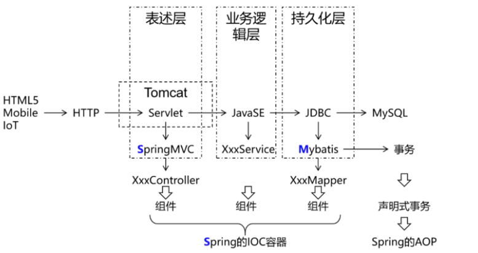
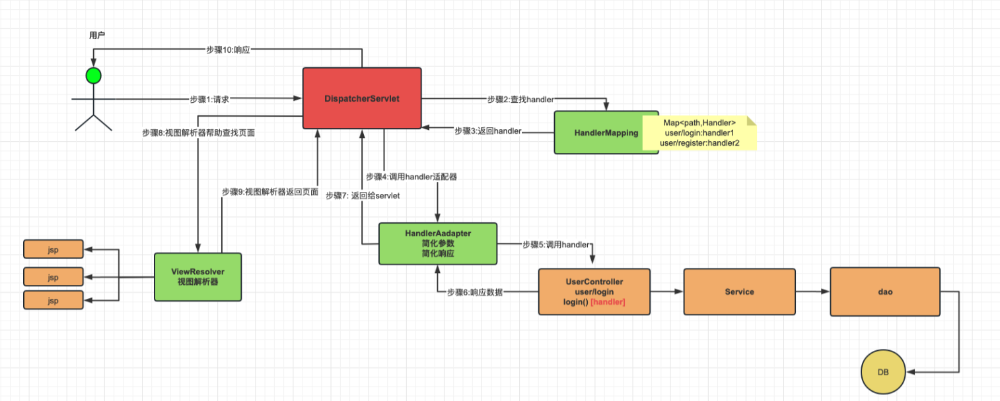

# SpringMVC简介

# 一、SpringMVC简介和体验

## 1.1 介绍
https://docs.spring.io/spring-framework/reference/web/webmvc.html
Spring Web MVC是基于Servlet API构建的原始Web框架，从一开始就包含在Spring Framework中。正式名称“Spring Web MVC”来自其源模块的名称（ `spring-webmvc` ），但它通常被称为“Spring MVC”。
在控制层框架历经Strust、WebWork、Strust2等诸多产品的历代更迭之后，目前业界普遍选择了SpringMVC作为Java EE项目表述层开发的**首选方案**。之所以能做到这一点，是因为SpringMVC具备如下显著优势：
    - **Spring 家族原生产品**，与IOC容器等基础设施无缝对接
        - 表述层各细分领域需要解决的问题**全方位覆盖**，提供**全面解决方案**
        - **代码清新简洁**，大幅度提升开发效率
        - 内部组件化程度高，可插拔式组件**即插即用**，想要什么功能配置相应组件即可
        - **性能卓著**，尤其适合现代大型、超大型互联网项目要求

原生Servlet API开发代码片段

```Java
protected void doGet(HttpServletRequest request, HttpServletResponse response) 
                                                        throws ServletException, IOException {  
    String userName = request.getParameter("userName");
    
    System.out.println("userName="+userName);
}
```

基于SpringMVC开发代码片段

```Java
@RequestMapping("/user/login")
public String login(@RequestParam("userName") String userName,Sting password){
    
    log.debug("userName="+userName);
    //调用业务即可
    
    return "result";
}
```

## 1.2 主要作用



SSM框架构建起单体项目的技术栈需求！其中的SpringMVC负责表述层（控制层）实现简化！
SpringMVC的作用主要覆盖的是表述层，例如：
 - 请求映射
 - 数据输入
 - 视图界面
 - 请求分发
 - 表单回显
 - 会话控制
 - 过滤拦截
 - 异步交互
 - 文件上传
 - 文件下载
 - 数据校验
 - 类型转换
 - 等等等

**最终总结：**

   1. 简化前端参数接收( 形参列表 )
   2. 简化后端数据响应(返回值)
   3. 以及其他......

## 1.3 核心组件和调用流程理解

 Spring MVC与许多其他Web框架一样，是围绕前端控制器模式设计的，其中中央 `Servlet`  `DispatcherServlet` 做整体请求处理调度！除了`DispatcherServlet`SpringMVC还会提供其他特殊的组件协作完成请求处理和响应呈现。
**SpringMVC处理请求流程：**



**SpringMVC涉及组件理解：**

1. DispatcherServlet :  SpringMVC提供，我们需要使用web.xml配置使其生效，它是整个流程处理的核心，所有请求都经过它的处理和分发！[ CEO ]
2. HandlerMapping :  SpringMVC提供，我们需要进行IoC配置使其加入IoC容器方可生效，它内部缓存handler(controller方法)和handler访问路径数据，被DispatcherServlet调用，用于查找路径对应的handler！[秘书] 
3. HandlerAdapter : SpringMVC提供，我们需要进行IoC配置使其加入IoC容器方可生效，它可以处理请求参数和处理响应数据数据，每次DispatcherServlet都是通过handlerAdapter间接调用handler，他是handler和DispatcherServlet之间的适配器！[经理]
4. Handler : handler又称处理器，他是Controller类内部的方法简称，是由我们自己定义，用来接收参数，向后调用业务，最终返回响应结果！[打工人]
5. ViewResovler : SpringMVC提供，我们需要进行IoC配置使其加入IoC容器方可生效！视图解析器主要作用简化模版视图页面查找的，但是需要注意，前后端分离项目，后端只返回JSON数据，不返回页面，那就不需要视图解析器！所以，视图解析器，相对其他的组件不是必须的！[财务]

## 1.4 快速体验
1. 体验场景需求
   
    在页面上展示hellospringmvc
    
2. 配置分析
        1. DispatcherServlet，设置处理所有请求！
            2. HandlerMapping,HandlerAdapter,Handler需要加入到IoC容器，供DS调用！
            3. Handler自己声明（Controller）需要配置到HandlerMapping中供DS查找！
3. 准备项目
 1. 创建项目
    springmvc-base-quick
    注意：需要转成maven/web程序！！
 2. 导入依赖

```XML
<properties>
    <spring.version>6.0.6</spring.version>
    <servlet.api>9.1.0</servlet.api>
    <maven.compiler.source>17</maven.compiler.source>
    <maven.compiler.target>17</maven.compiler.target>
    <project.build.sourceEncoding>UTF-8</project.build.sourceEncoding>
</properties>

<dependencies>
    <!-- springioc相关依赖  -->
    <dependency>
        <groupId>org.springframework</groupId>
        <artifactId>spring-context</artifactId>
        <version>${spring.version}</version>
    </dependency>

    <!-- web相关依赖  -->
    <!-- 在 pom.xml 中引入 Jakarta EE Web API 的依赖 -->
    <!--
        在 Spring Web MVC 6 中，Servlet API 迁移到了 Jakarta EE API，因此在配置 DispatcherServlet 时需要使用
         Jakarta EE 提供的相应类库和命名空间。错误信息 “‘org.springframework.web.servlet.DispatcherServlet’
         is not assignable to ‘javax.servlet.Servlet,jakarta.servlet.Servlet’” 表明你使用了旧版本的
         Servlet API，没有更新到 Jakarta EE 规范。
    -->
    <dependency>
        <groupId>jakarta.platform</groupId>
        <artifactId>jakarta.jakartaee-web-api</artifactId>
        <version>${servlet.api}</version>
        <scope>provided</scope>
    </dependency>

    <!-- springwebmvc相关依赖  -->
    <dependency>
        <groupId>org.springframework</groupId>
        <artifactId>spring-webmvc</artifactId>
        <version>${spring.version}</version>
    </dependency>

</dependencies>
```
4. Controller声明

```Java
@Controller
public class HelloController {

    //handlers

    /**
     * handler就是controller内部的具体方法
     * @RequestMapping("/springmvc/hello") 就是用来向handlerMapping中注册的方法注解!
     * @ResponseBody 代表向浏览器直接返回数据!
     */
    @RequestMapping("/springmvc/hello")
    @ResponseBody
    public String hello(){
        System.out.println("HelloController.hello");
        return "hello springmvc!!";
    }
}

```
5. Spring MVC核心组件配置类
声明springmvc涉及组件信息的配置类

```Java
//TODO: SpringMVC对应组件的配置类 [声明SpringMVC需要的组件信息]

//TODO: 导入handlerMapping和handlerAdapter的三种方式
 //1.自动导入handlerMapping和handlerAdapter [推荐]
 //2.可以不添加,springmvc会检查是否配置handlerMapping和handlerAdapter,没有配置默认加载
 //3.使用@Bean方式配置handlerMapper和handlerAdapter
@EnableWebMvc     
@Configuration
@ComponentScan(basePackages = "com.atguigu.controller") //TODO: 进行controller扫
//WebMvcConfigurer springMvc进行组件配置的规范,配置组件,提供各种方法! 前期可以实现
public class SpringMvcConfig implements WebMvcConfigurer {

    @Bean
    public HandlerMapping handlerMapping(){
        return new RequestMappingHandlerMapping();
    }

    @Bean
    public HandlerAdapter handlerAdapter(){
        return new RequestMappingHandlerAdapter();
    }
    
}

```
    6. SpringMVC环境搭建
    
        > 对于使用基于 Java 的 Spring 配置的应用程序，建议这样做，如以下示例所示：

```Java
//TODO: SpringMVC提供的接口,是替代web.xml的方案,更方便实现完全注解方式ssm处理!
//TODO: Springmvc框架会自动检查当前类的实现类,会自动加载 getRootConfigClasses / getServletConfigClasses 提供的配置类
//TODO: getServletMappings 返回的地址 设置DispatherServlet对应处理的地址
public class MyWebAppInitializer extends AbstractAnnotationConfigDispatcherServletInitializer {

  /**
   * 指定service / mapper层的配置类
   */
  @Override
  protected Class<?>[] getRootConfigClasses() {
    return null;
  }

  /**
   * 指定springmvc的配置类
   * @return
   */
  @Override
  protected Class<?>[] getServletConfigClasses() {
    return new Class<?>[] { SpringMvcConfig.class };
  }

  /**
   * 设置dispatcherServlet的处理路径!
   * 一般情况下为 / 代表处理所有请求!
   */
  @Override
  protected String[] getServletMappings() {
    return new String[] { "/" };
  }
}
```


