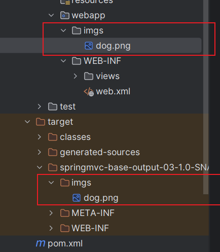
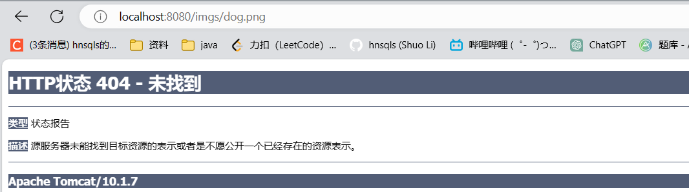

# SpringMVC返回数据

# 一 控制页面跳转

## 1.1 快速使用

1. 开发模式回顾

    在 Web 开发中，有两种主要的开发模式：前后端分离和混合开发。

    前后端分离模式：[重点]

      指将前端的界面和后端的业务逻辑通过接口分离开发的一种方式。开发人员使用不同的技术栈和框架，前端开发人员主要负责页面的呈现和用户交互，后端开发人员主要负责业务逻辑和数据存储。前后端通信通过 API 接口完成，数据格式一般使用 JSON 或 XML。前后端分离模式可以提高开发效率，同时也有助于代码重用和维护。

    混合开发模式：

      指将前端和后端的代码集成在同一个项目中，共享相同的技术栈和框架。这种模式在小型项目中比较常见，可以减少学习成本和部署难度。但是，在大型项目中，这种模式会导致代码耦合性很高，维护和升级难度较大。

      对于混合开发，我们就需要使用动态页面技术，动态展示Java的共享域数据！！
2. jsp技术了解

    JSP（JavaServer Pages）是一种动态网页开发技术，它是由 Sun 公司提出的一种基于 Java 技术的 Web 页面制作技术，可以在 HTML 文件中嵌入 Java 代码，使得生成动态内容的编写更加简单。

    JSP 最主要的作用是生成动态页面。它允许将 Java 代码嵌入到 HTML 页面中，以便使用 Java 进行数据库查询、处理表单数据和生成 HTML 等动态内容。另外，JSP 还可以与 Servlet 结合使用，实现更加复杂的 Web 应用程序开发。

    JSP 的主要特点包括：

    1. 简单：JSP 通过将 Java 代码嵌入到 HTML 页面中，使得生成动态内容的编写更加简单。
    2. 高效：JSP 首次运行时会被转换为 Servlet，然后编译为字节码，从而可以启用 Just-in-Time（JIT）编译器，实现更高效的运行。
    3. 多样化：JSP 支持多种标准标签库，包括 JSTL（JavaServer Pages 标准标签库）、EL（表达式语言）等，可以帮助开发人员更加方便的处理常见的 Web 开发需求。

    总之，JSP 是一种简单高效、多样化的动态网页开发技术，它可以方便地生成动态页面和与 Servlet 结合使用，是 Java Web 开发中常用的技术之一。
3. 准备jsp页面和依赖

    pom.xml依赖

```XML
<!-- jsp需要依赖! jstl-->
<dependency>
    <groupId>jakarta.servlet.jsp.jstl</groupId>
    <artifactId>jakarta.servlet.jsp.jstl-api</artifactId>
    <version>3.0.0</version>
</dependency>
```

    jsp页面创建
    
    建议位置：/WEB-INF/下，避免外部直接访问！
    
    位置：/WEB-INF/views/home.jsp

```Java
<%@ page contentType="text/html;charset=UTF-8" language="java" %>
<html>
  <head>
    <title>Title</title>
  </head>
  <body>
        <!-- 可以获取共享域的数据,动态展示! jsp== 后台vue -->
        ${msg}
  </body>
</html>

```
4. 快速响应模版页面
    1. 配置jsp视图解析器

        

```Java
@EnableWebMvc  //json数据处理,必须使用此注解,因为他会加入json处理器
@Configuration
@ComponentScan(basePackages = "com.atguigu.controller") //TODO: 进行controller扫描

//WebMvcConfigurer springMvc进行组件配置的规范,配置组件,提供各种方法! 前期可以实现
public class SpringMvcConfig implements WebMvcConfigurer {

    //配置jsp对应的视图解析器
    @Override
    public void configureViewResolvers(ViewResolverRegistry registry) {
        //快速配置jsp模板语言对应的
        registry.jsp("/WEB-INF/views/",".jsp");
    }
}
```
    2. handler返回视图

```Java
/**
 *  跳转到提交文件页面  /save/jump
 *  
 *  如果要返回jsp页面!
 *     1.方法返回值改成字符串类型
 *     2.返回逻辑视图名即可    
 *         <property name="prefix" value="/WEB-INF/views/"/>
 *            + 逻辑视图名 +
 *         <property name="suffix" value=".jsp"/>
 */
@GetMapping("jump")
public String jumpJsp(Model model){
    System.out.println("FileController.jumpJsp");
    model.addAttribute("msg","request data!!");
    return "home";
}
```

## 1.2转发和重定向

* 在 Spring MVC 中，Handler 方法返回值来实现快速转发，可以使用 `redirect` 或者 `forward` 关键字来实现重定向。

```java
@Controller
@RequestMapping("/jsp")
public class indexController {

    /**
     *  返回jsp页面
     *   1. 返回字符串类型， 于视图解析器拼接
     *   2. 不能添加@ResponseBody会直接返回给浏览器，
     *
     */

    @RequestMapping("/data")
    public  String data(HttpServletRequest request){
        request.setAttribute("data","hnsqls");
        return "index";
    }

    /**转发
     * 1. 返回字符串  ------》请求资源的地址
     * 2.return “forward:/转发地址”
     *  */

    @RequestMapping("/forward")
    public  String forward(){
        return "forward:/jsp/data";
    }

    /** 重定向
     * 1. 返回字符串 ----------》请求的资源地址
     * 2. 返回字符 return “redirect：/重定向地址”
     *
     */

    @RequestMapping("/redirect")
    public  String redirect(){

        return "redirect: /jsp/data";
    }
    /** 地址路径问题
     * 不使用springmvc   原生的request，response
     * 转发是项目下的资源跳转，路径:项目下的地址，忽略根路径
     * 重定向可以是项目以外的地址，二次请求，路径 要写根地址
     *
     * 使用springmvc
     *  forward：路径 | redirect：路径  都不需要写根路径。
     *  转发和重定向写的地址都一样，springmvc会自动给重定向添加 根地址
     *
     */
}
```


# 二 返回JSON数据

* json依赖
* handlerAdopter 配置json转换器
* @Controller + @ResponseBody  = @RestController

```java
/**
 * 返回json数据 , ---->前后端分离
 *  1.@ResponseBody  不找视图解析器，直接放入响应体返回
 *  2. 直接返回实体类，由handlerAdopter 处理为json对象（有json依赖，以及配置给了handlerAdopter）
 *  3. @Controller + @ResponseBody  = @RestController
 */
@Controller
@RequestMapping("/json")
public class JsonController  {
    @ResponseBody
    @RequestMapping("/user")
    public User user(){
        User user = new User();
        user.setAge(21);
        user.setName("hnsqls");
        return  user;
    }

    @ResponseBody
    @RequestMapping("/user2")
    public List<User> user2(){
        User user = new User();
        user.setAge(21);
        user.setName("hnsqls");
        List<User> users = new ArrayList<>();
        users.add(user);
        return  users;
    }

}
```


# 三 返回静态资源

1. **静态资源概念**

资源本身已经是可以直接拿到浏览器上使用的程度了，**不需要在服务器端做任何运算、处理**。典型的静态资源包括：

- 纯HTML文件
- 图片
- CSS文件
- JavaScript文件
- ……

2. 静态资源访问和问题解决



* 访问静态资源



* 问题分析
  - DispatcherServlet 的 url-pattern 配置的是“/”，表示拦截所有的请求，交给handlerAdopter处理。
  - 对于handlerAdopter来说去寻找对应的 @RequestMapping 才能找到处理请求的方法。
  - 现在 images/mi.jpg 请求没有对应的 @RequestMapping 所以返回 404
* 原生的javaweb，有默认servlet专于处理静态资源。我们现在使用springmvc怎么处理呢？


* 问题解决

  在配置类中开启默认的静态资源处理

  ```java
    public void configureDefaultServletHandling(DefaultServletHandlerConfigurer configurer) {
          configurer.enable();
      }
  ```

```java
@EnableWebMvc  //json数据处理,必须使用此注解,因为他会加入json处理器
@Configuration
@ComponentScan(basePackages = "com.atguigu.controller") //TODO: 进行controller扫描
//WebMvcConfigurer springMvc进行组件配置的规范,配置组件,提供各种方法! 前期可以实现
public class SpringMvcConfig implements WebMvcConfigurer {

    //配置jsp对应的视图解析器
    @Override
    public void configureViewResolvers(ViewResolverRegistry registry) {
        //快速配置jsp模板语言对应的
        registry.jsp("/WEB-INF/views/",".jsp");
    }
    
    //开启静态资源处理 <mvc:default-servlet-handler/>
    @Override
    public void configureDefaultServletHandling(DefaultServletHandlerConfigurer configurer) {
        configurer.enable();
    }
}
```

**小结**

​	当服务端接受到客户端的请求时，会经由handlerAdopter处理，去handlermapping中寻找对应请求的handler。如果找不到，就会由默认的servlet处理，寻找静态资源。

# 四 RESTFUL风格设计

* 客户端于服务端以http进行通信，作为软件开发者，我们需要考虑以下几个方面
  * 1.如何设计url
  * 2.如何传参？ 路径传参？url传参（param）？还是json传参
  * 3.以何种方式请求  GET|POST|DELETE|PUT ....等。
* RESTFUL就是标准的http编写风格。


## 4.1 RESTFUL风格特点

1. 每一个URI代表1种资源（URI 是名词）；
2. 客户端使用GET、POST、PUT、DELETE 4个表示操作方式的动词对服务端资源进行操作：GET用来获取资源，POST用来新建资源（也可以用于更新资源），PUT用来更新资源，DELETE用来删除资源；
3. 资源的表现形式是XML或者**JSON**；
4. 客户端与服务端之间的交互在请求之间是无状态的，从客户端到服务端的每个请求都必须包含理解请求所必需的信息。


## 4.2 RESTFUL风格设计规范

1. **HTTP协议请求方式要求**

    REST 风格主张在项目设计、开发过程中，具体的操作符合**HTTP协议定义的请求方式的语义**。

| 操作     | 请求方式 |
| -------- | -------- |
| 查询操作 | GET      |
| 保存操作 | POST     |
| 删除操作 | DELETE   |
| 更新操作 | PUT      |

2. **URL路径风格要求**

REST风格下每个资源都应该有一个唯一的标识符，例如一个 URI（统一资源标识符）或者一个 URL（统一资源定位符）。资源的标识符应该能明确地说明该资源的信息，同时也应该是可被理解和解释的！

使用URL+请求方式确定具体的动作，他也是一种标准的HTTP协议请求！

| 操作 | 传统风格                | REST 风格                              |
| ---- | ----------------------- | -------------------------------------- |
| 保存 | /CRUD/saveEmp           | URL 地址：/CRUD/emp 请求方式：POST     |
| 删除 | /CRUD/removeEmp?empId=2 | URL 地址：/CRUD/emp/2 请求方式：DELETE |
| 更新 | /CRUD/updateEmp         | URL 地址：/CRUD/emp 请求方式：PUT      |
| 查询 | /CRUD/editEmp?empId=2   | URL 地址：/CRUD/emp/2 请求方式：GET    |

3. 传参要求

1. 路径传参，要能标识唯一资源时使用
2. 多个参数，可以使用param传参
3. 请求体：使用json

## 4.3RESTFUL设计风格的好处

1. 含蓄，安全

    使用问号键值对的方式给服务器传递数据太明显，容易被人利用来对系统进行破坏。使用 REST 风格携带数据不再需要明显的暴露数据的名称。
2. 风格统一

    URL 地址整体格式统一，从前到后始终都使用斜杠划分各个单词，用简单一致的格式表达语义。
3. 无状态

    在调用一个接口（访问、操作资源）的时候，可以不用考虑上下文，不用考虑当前状态，极大的降低了系统设计的复杂度。
4. 严谨，规范

    严格按照 HTTP1.1 协议中定义的请求方式本身的语义进行操作。
5. 简洁，优雅

    过去做增删改查操作需要设计4个不同的URL，现在一个就够了。

| 操作 | 传统风格                | REST 风格                              |
| ---- | ----------------------- | -------------------------------------- |
| 保存 | /CRUD/saveEmp           | URL 地址：/CRUD/emp 请求方式：POST     |
| 删除 | /CRUD/removeEmp?empId=2 | URL 地址：/CRUD/emp/2 请求方式：DELETE |
| 更新 | /CRUD/updateEmp         | URL 地址：/CRUD/emp 请求方式：PUT      |
| 查询 | /CRUD/editEmp?empId=2   | URL 地址：/CRUD/emp/2 请求方式：GET    |

6. 丰富的语义

    通过 URL 地址就可以知道资源之间的关系。它能够把一句话中的很多单词用斜杠连起来，反过来说就是可以在 URL 地址中用一句话来充分表达语义。

    > [http://localhost:8080/shop](http://localhost:8080/shop) [http://localhost:8080/shop/product](http://localhost:8080/shop/product) [http://localhost:8080/shop/product/cellPhone](http://localhost:8080/shop/product/cellPhone) [http://localhost:8080/shop/product/cellPhone/iPhone](http://localhost:8080/shop/product/cellPhone/iPhone) 


# 五 RESTFul设计演示

1. 需求分析

- 数据结构： User {id 唯一标识,name 用户名，age 用户年龄}
- 功能分析
    - 用户数据分页展示功能（条件：page 页数 默认1，size 每页数量 默认 10）
    - 保存用户功能
    - 根据用户id查询用户详情功能
    - 根据用户id更新用户数据功能
    - 根据用户id删除用户数据功能
    - 多条件模糊查询用户功能（条件：keyword 模糊关键字，page 页数 默认1，size 每页数量 默认 10）


2. RESTFul风格接口设计

|          |                  |                               |              |
| -------- | ---------------- | ----------------------------- | ------------ |
| 功能     | 接口和请求方式   | 请求参数                      | 返回值       |
| 分页查询 | GET  /user       | page=1&size=10                | { 响应数据 } |
| 用户添加 | POST /user       | { user 数据 }                 | {响应数据}   |
| 用户详情 | GET /user/1      | 路径参数                      | {响应数据}   |
| 用户更新 | PUT /user        | { user 更新数据}              | {响应数据}   |
| 用户删除 | DELETE /user/1   | 路径参数                      | {响应数据}   |
| 条件模糊 | GET /user/search | page=1&size=10&keywork=关键字 | {响应数据}   |

2. **问题讨论**

    为什么查询用户详情，就使用路径传递参数，多条件模糊查询，就使用请求参数传递？

    误区：restful风格下，不是所有请求参数都是路径传递！可以使用其他方式传递！

    在 RESTful API 的设计中，路径和请求参数和请求体都是用来向服务器传递信息的方式。

    - 对于查询用户详情，使用路径传递参数是因为这是一个单一资源的查询，即查询一条用户记录。使用路径参数可以明确指定所请求的资源，便于服务器定位并返回对应的资源，也符合 RESTful 风格的要求。
    - 而对于多条件模糊查询，使用请求参数传递参数是因为这是一个资源集合的查询，即查询多条用户记录。使用请求参数可以通过组合不同参数来限制查询结果，路径参数的组合和排列可能会很多，不如使用请求参数更加灵活和简洁。

    此外，还有一些通用的原则可以遵循：

    - 路径参数应该用于指定资源的唯一标识或者 ID，而请求参数应该用于指定查询条件或者操作参数。
    - 请求参数应该限制在 10 个以内，过多的请求参数可能导致接口难以维护和使用。
    - 对于敏感信息，最好使用 POST 和请求体来传递参数。

3. 实现

```java
package com.ls.controller;


import com.ls.pojo.User;
import org.springframework.stereotype.Controller;
import org.springframework.web.bind.annotation.*;

import java.util.List;

@Controller
@RequestMapping("/user")
@ResponseBody
public class UserController {
    /**用户数据分页展示功能（条件：page 页数 默认1，size 每页数量 默认 10）
     * 查询 GET
     * 资源不唯一 不用路径传擦， 用param传擦
     *  GET  /user?page=1&size=10
     */

    @GetMapping
    public List<User> findPageUser(@RequestParam(required = false,defaultValue = "1") int page,
                                   @RequestParam(required = false,defaultValue = "10") int size){
        System.out.println("page = " + page + ", size = " + size);
        //逻辑处理
        return null;
    }
    /**保存用户功能
     * POST  param|json（推荐）
     */
    @PostMapping
    public  User saveUser(@RequestBody User user){
        System.out.println("user = " + user);
        //处理逻辑
        return user;
    }

    /** 根据用户id查询用户详情功能
     *  GET /user/id  路径传参
     */

    @RequestMapping(value = "/{id}",method = RequestMethod.GET)
    public User findUserById(@PathVariable int id){
        System.out.println("查询用户信息 + id = " + id);
        //处理逻辑
        return null;
    }

    /** 根据用户id更新用户数据功能
     * 更新  PUT
     * 单个标识   路径传参
     * PUT /user/id
     *
     */
    @PutMapping("/{id}")
    public User updateUserById(@PathVariable int id,@PathVariable User user){
        System.out.println("更新用户信息"+"id = " + id);
        //处理逻辑
        return null;
    }

    /**根据用户id删除用户数据功能
     * 删除 delete
     * id唯一标识  路径传参
     * DELETE /user/id
     */
    @DeleteMapping("/{id}")
    public int deleteUserById(@PathVariable int id){
        System.out.println("删除：id = " + id);
        //处理逻辑
        return 1;
    }

    /** 多条件模糊查询用户功能（条件：keyword 模糊关键字，page 页数 默认1，size 每页数量 默认 10）
     * 查询 GET
     * 标识不唯一   不适用路径传参，param传参
     * GET /user?keyword=xx&page=x&size=x
     * 需要注意的时，根据整篇标识，此时的Mapping不唯一  方式 + url
     * 需要改变url 如下/user?keyword=20&page=20&size=50
     *
     */
    @GetMapping("search")
    public List<User> findUser(String keyword,
                               @RequestParam(required = false,defaultValue = "1") int page,
                               @RequestParam(required = false,defaultValue = "10") int  size){
        System.out.println("模糊查询 keyword = " + keyword + ", page = " + page + ", size = " + size);
        //逻辑处理
        return null;
    }

}

```

**总结**

​	 RESTFul只是一种标准的设置http的规则，不是强制要求，不过作为开发者以RESTFul风格设计url，更为合理，优雅。

先确定请求方式，查询-->GET，删除--->DELETE，这两种几乎都不需要使用请求体传擦，一般就根据查询或删除的资源时候唯一来选择param传参或路径传参。更新--->PUT,增加---->POST。在确定如何传参，如果资源唯一就路径传参，资源不唯一param传参，在需要传入隐私数据或复杂数据使用json传参。GET|DELETE|PUT|POST 请求方式，只是RESTFul风格标准这样编写http。

