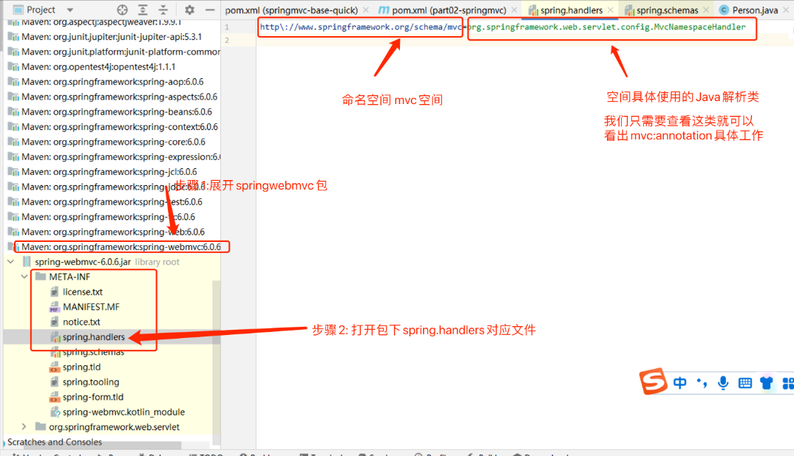
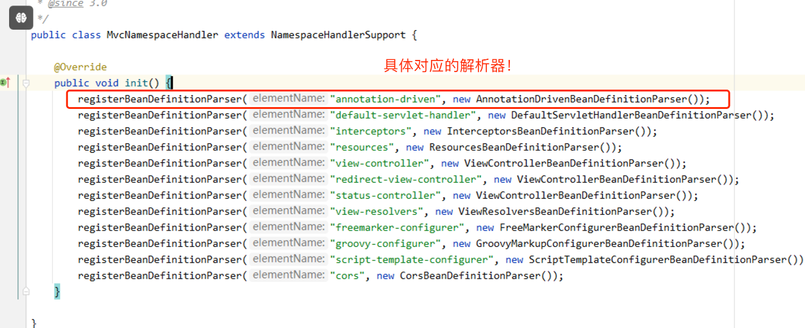

  # SpringMVC接收数据

# 一 访问路径以及指定请求方法

```java
@Controller
public class UserController {
    /**
     * @WebSevlet (" 必须以/开头")
     * @RequstMapping(" 不要求 / 开头 ")
     *1. 精准地址  ，多个 ("地址1“，”地址2“)
     * 2. 支持模糊查询  * 任意一层字符串。但是只能一层
     * 3. RequestMapping("")可以作用在方法上，也可以作用在类上。
     *      常用的就是在类上加一层路径，在方法上在加一层路径。这样就省区了在方法上都要加上两层路径
     *
     * 4.请求方式指定
     *  get|post|put|delete
     *   @RequestMapping("/user/login") 默认任何请求方式都可以访问
     *   指定请求方式  @RequestMapping(value = "/user/login",method = RequestMethod.POST)
     *   多种方式  @RequestMapping(value = "/user/register",method = {RequestMethod.GET,RequestMethod.POST})
     *   不符合请求方式 会出现405异常。
     *
     *
     *   5.进阶注解，请求方式   只能用在方法上
     *       @PostMapping("/user/login")
     *        @RequestMapping(value = "/user/login",method = RequestMethod.POST) 等价
     *
     *
     */
    @RequestMapping(value = "/user/login",method = RequestMethod.POST) //指定访问地址，并且注册到handleMappering中
    @PostMapping("/user/login")
    public String login(){
        return  "login-----";

    }

    @RequestMapping(value = "/user/register",method = {RequestMethod.GET,RequestMethod.POST}) //指定访问地址，并且注册到handleMappering中
    public String register(){
        return  "register------";

    }


}

```

# 二接受参数

## 2.1 param 和 json参数比较

param  key=value&key2=value2&key3=value3

json {key:value,key:value}

  在 HTTP 请求中，我们可以选择不同的参数类型，如 param 类型和 JSON 类型。下面对这两种参数类型进行区别和对比：

  1. 参数编码：  

      param 类型的参数会被编码为 ASCII 码。例如，假设 `name=john doe`，则会被编码为 `name=john%20doe`。而 JSON 类型的参数会被编码为 UTF-8。
  2. 参数顺序：  

      param 类型的参数没有顺序限制。但是，JSON 类型的参数是有序的。JSON 采用键值对的形式进行传递，其中键值对是有序排列的。
  3. 数据类型：  

      param 类型的参数仅支持字符串类型、数值类型和布尔类型等简单数据类型。而 JSON 类型的参数则支持更复杂的数据类型，如数组、对象等。
  4. 嵌套性：  

      param 类型的参数不支持嵌套。但是，JSON 类型的参数支持嵌套，可以传递更为复杂的数据结构。
  5. 可读性：  

      param 类型的参数格式比 JSON 类型的参数更加简单、易读。但是，JSON 格式在传递嵌套数据结构时更加清晰易懂。

  **总的来说，param 类型的参数适用于单一的数据传递，而 JSON 类型的参数则更适用于更复杂的数据结构传递。根据具体的业务需求，需要选择合适的参数类型。在实际开发中，常见的做法是：在 GET 请求中采用 param 类型的参数，而在 POST 请求中采用 JSON 类型的参数传递。** 

## 2.2param 四种接受参数

* 直接接收
* 注解接收
* 一key多值
* 实体对象

```java
/**
 * 参数的接收
 *
 */

@Controller
@RequestMapping("/param")
public class ParamController {

    //直接接受 param   /param/data?name=hnsqls&age=21
    // 1.方法参数名要和param属性名相同
    // *   2.不传值不报错
    @RequestMapping(value = "/data",method = RequestMethod.GET)
    @ResponseBody
    public String data(String name,int age){
        System.out.println("name = " + name + ", age = " + age);
        return "name = " + name + ", age = " + age;
    }


    /**  注解接收 @RequestParam
     *   参数名和param属性名不一致，可以使用@RequestParam注解，与之匹配
     * @RequestParam只能在参数上使用
     *  可以限制，那些值是必须传的,那些是不穿值的
     *          默认是必须  若没传值会报400错误。
     *          使用了该注解还想不必须传值需要设置属性，还可以设置默认值 ,@RequestParam(required = false,defaultValue = "1")
     */

    // /param/data1?username=root&password=1234
    @GetMapping("/data1")
    @ResponseBody
    public String data1(@RequestParam(value = "name") String username,@RequestParam(required = false,defaultValue = "1") String password){
        System.out.println("username = " + username + ", password = " + password);
        return "username = " + username + ", password = " + password;
    }


    /** 特殊值
     *  一key 对多个value 如列表的值hbs=唱&hbs=跳&hbs=rap
     * 使用@RequsetParam 用List接受参数
     *
     *
     * 实体类对象接受值   用户注册（用户的信息） ----》对应的实体类
     *      实体对象属性和param key相同,和对应的get|set方法。---------》形参列表声明实体对象即可。

     */

    //param  /param/data2?hbs=唱&hbs=跳&hbs=rap
    @GetMapping("/data2")
    @ResponseBody
    public  String data2(@RequestParam List<String> hbs){
        System.out.println("hbs = " + hbs);
        return "ok";
    }


    //param  /param/data3?name=hnsqls&password=123456
    @RequestMapping("/data3")
    @ResponseBody
    public  String data3(User user){
        System.out.println("user = " + user);
        return user.toString();
    }
}
```

## 2.3 路径传参

路径传递参数是一种在 URL 路径中传递参数的方式。在 RESTful 的 Web 应用程序中，经常使用路径传递参数来表示资源的唯一标识符或更复杂的表示方式。而 Spring MVC 框架提供了 `@PathVariable` 注解来处理路径传递参数。

`@PathVariable` 注解允许将 URL 中的占位符映射到控制器方法中的参数。

例如，如果我们想将 `/user/{id}` 路径下的 `{id}` 映射到控制器方法的一个参数中，则可以使用 `@PathVariable` 注解来实现。

下面是一个使用 `@PathVariable` 注解处理路径传递参数的示例：

```Java
 /**
 * 动态路径设计: /user/{动态部分}/{动态部分}   动态部分使用{}包含即可! {}内部动态标识!
 * 形参列表取值: @PathVariable Long id  如果形参名 = {动态标识} 自动赋值!
 *              @PathVariable("动态标识") Long id  如果形参名 != {动态标识} 可以通过指定动态标识赋值!
 *
 * 访问测试:  /param/user/1/root  -> id = 1  uname = root
 */
@GetMapping("/user/{id}/{name}")
@ResponseBody
public String getUser(@PathVariable Long id, 
                      @PathVariable("name") String uname) {
    System.out.println("id = " + id + ", uname = " + uname);
    return "user_detail";
}
```

## 2.4 接受json数据

出现415不支持类型的原因是

* java原生API不能处理json数据 需要引入jackson依赖
* 配置HandlerAdopter使其有处理json串的能力.

依赖

```xml
<dependency>
    <groupId>com.fasterxml.jackson.core</groupId>
    <artifactId>jackson-databind</artifactId>
    <version>2.15.0</version>
</dependency>
```

配置类

```java
/**
 *  controller handlerMapping handlerAdapter 核心组件加入到ioc容器
 */
@EnableWebMvc //配置给handleAdopter 处理json格式数据的能力
@Configuration
@ComponentScan({"com.ls.param","com.ls.path","com.ls.controller","com.ls.json"})
public class MainConfig {

    @Bean
    public RequestMappingHandlerMapping handlerMapping(){
        return  new RequestMappingHandlerMapping();
    }

    @Bean
    public RequestMappingHandlerAdapter handlerAdapter(){
        return  new RequestMappingHandlerAdapter();
    }
}
```

前端传递 JSON 数据时，Spring MVC 框架可以使用 `@RequestBody` 注解来将 JSON 数据转换为 Java 对象。`@RequestBody` 注解表示当前方法参数的值应该从请求体中获取，并且需要指定 value 属性来指示请求体应该映射到哪个参数上。其使用方式和示例代码如下：

1. 前端发送 JSON 数据的示例：（使用postman测试）

```JSON
{
  "name": "张三",
  "age": 18,
  "gender": "男"
}
```
2. 定义一个用于接收 JSON 数据的 Java 类，例如：

```Java
public class Person {
  private String name;
  private int age;
  private String gender;
  // getter 和 setter 略
}
```
3. 在控制器中，使用 `@RequestBody` 注解来接收 JSON 数据，并将其转换为 Java 对象，例如：

```Java
@PostMapping("/person")
@ResponseBody
public String addPerson(@RequestBody Person person) {

  // 在这里可以使用 person 对象来操作 JSON 数据中包含的属性
  return "success";
}
```

在上述代码中，@RequestBody 注解将请求体中的 JSON 数据映射到 Person 类型的 person 参数上，并将其作为一个对象来传递给 addPerson() 方法进行处理。

## 2.5 @EnableWebMvc注解说明

@EnableWebMvc注解效果等同于在 XML 配置中，可以使用 `<mvc:annotation-driven>` 元素！我们来解析`<mvc:annotation-driven>`对应的解析工作！

让我们来查看下`<mvc:annotation-driven>`具体的动作！

* 先查看<mvc:annotation-driven>标签最终对应解析的Java类
* 
* 查看解析类中具体的动作即可



* 打开源码

```java
​```Java
class AnnotationDrivenBeanDefinitionParser implements BeanDefinitionParser {

  public static final String HANDLER_MAPPING_BEAN_NAME = RequestMappingHandlerMapping.class.getName();

  public static final String HANDLER_ADAPTER_BEAN_NAME = RequestMappingHandlerAdapter.class.getName();

  static {
    ClassLoader classLoader = AnnotationDrivenBeanDefinitionParser.class.getClassLoader();
    javaxValidationPresent = ClassUtils.isPresent("jakarta.validation.Validator", classLoader);
    romePresent = ClassUtils.isPresent("com.rometools.rome.feed.WireFeed", classLoader);
    jaxb2Present = ClassUtils.isPresent("jakarta.xml.bind.Binder", classLoader);
    jackson2Present = ClassUtils.isPresent("com.fasterxml.jackson.databind.ObjectMapper", classLoader) &&
            ClassUtils.isPresent("com.fasterxml.jackson.core.JsonGenerator", classLoader);
    jackson2XmlPresent = ClassUtils.isPresent("com.fasterxml.jackson.dataformat.xml.XmlMapper", classLoader);
    jackson2SmilePresent = ClassUtils.isPresent("com.fasterxml.jackson.dataformat.smile.SmileFactory", classLoader);
    jackson2CborPresent = ClassUtils.isPresent("com.fasterxml.jackson.dataformat.cbor.CBORFactory", classLoader);
    gsonPresent = ClassUtils.isPresent("com.google.gson.Gson", classLoader);
  }


  @Override
  @Nullable
  public BeanDefinition parse(Element element, ParserContext context) {
    //handlerMapping加入到ioc容器
    readerContext.getRegistry().registerBeanDefinition(HANDLER_MAPPING_BEAN_NAME, handlerMappingDef);

    //添加jackson转化器
    addRequestBodyAdvice(handlerAdapterDef);
    addResponseBodyAdvice(handlerAdapterDef);

    //handlerAdapter加入到ioc容器
    readerContext.getRegistry().registerBeanDefinition(HANDLER_ADAPTER_BEAN_NAME, handlerAdapterDef);
    return null;
  }

  //具体添加jackson转化对象方法
  protected void addRequestBodyAdvice(RootBeanDefinition beanDef) {
    if (jackson2Present) {
      beanDef.getPropertyValues().add("requestBodyAdvice",
          new RootBeanDefinition(JsonViewRequestBodyAdvice.class));
    }
  }

  protected void addResponseBodyAdvice(RootBeanDefinition beanDef) {
    if (jackson2Present) {
      beanDef.getPropertyValues().add("responseBodyAdvice",
          new RootBeanDefinition(JsonViewResponseBodyAdvice.class));
    }
  }

​```
```

* 总结 @EnableWebMvc
* 添加HandlerMapping 和HandleAdaptor 到ioc中
* 添加jackson处理能力


## 2.6 接收Cookie数据

  可以使用 `@CookieValue` 注释将 HTTP Cookie 的值绑定到控制器中的方法参数。

  考虑使用以下 cookie 的请求：

```Java
JSESSIONID=415A4AC178C59DACE0B2C9CA727CDD84
```

  下面的示例演示如何获取 cookie 值：

```Java
@GetMapping("/demo")
public void handle(@CookieValue("JSESSIONID") String cookie) { 
  //...
}
```

## 2.7接收请求头数据

  可以使用 `@RequestHeader` 批注将请求标头绑定到控制器中的方法参数。

  请考虑以下带有标头的请求：

```Java
Host                    localhost:8080
Accept                  text/html,application/xhtml+xml,application/xml;q=0.9
Accept-Language         fr,en-gb;q=0.7,en;q=0.3
Accept-Encoding         gzip,deflate
Accept-Charset          ISO-8859-1,utf-8;q=0.7,*;q=0.7
Keep-Alive              300
```

  下面的示例获取 `Accept-Encoding` 和 `Keep-Alive` 标头的值：

```Java
@GetMapping("/demo")
public void handle(
    @RequestHeader("Accept-Encoding") String encoding, 
    @RequestHeader("Keep-Alive") long keepAlive) { 
  //...
}
```

## 2.8原生Api对象操作

  https://docs.spring.io/spring-framework/reference/web/webmvc/mvc-controller/ann-methods/arguments.html

  下表描述了支持的控制器方法参数

| Controller method argument 控制器方法参数                    | Description                                                  |
| ------------------------------------------------------------ | ------------------------------------------------------------ |
| `jakarta.servlet.ServletRequest`, `jakarta.servlet.ServletResponse` | 请求/响应对象                                                |
| `jakarta.servlet.http.HttpSession`                           | 强制存在会话。因此，这样的参数永远不会为 `null` 。           |
| `java.io.InputStream`, `java.io.Reader`                      | 用于访问由 Servlet API 公开的原始请求正文。                  |
| `java.io.OutputStream`, `java.io.Writer`                     | 用于访问由 Servlet API 公开的原始响应正文。                  |
| `@PathVariable`                                              | 接收路径参数注解                                             |
| `@RequestParam`                                              | 用于访问 Servlet 请求参数，包括多部分文件。参数值将转换为声明的方法参数类型。 |
| `@RequestHeader`                                             | 用于访问请求标头。标头值将转换为声明的方法参数类型。         |
| `@CookieValue`                                               | 用于访问Cookie。Cookie 值将转换为声明的方法参数类型。        |
| `@RequestBody`                                               | 用于访问 HTTP 请求正文。正文内容通过使用 `HttpMessageConverter` 实现转换为声明的方法参数类型。 |
| `java.util.Map`, `org.springframework.ui.Model`, `org.springframework.ui.ModelMap` | 共享域对象，并在视图呈现过程中向模板公开。                   |
| `Errors`, `BindingResult`                                    | 验证和数据绑定中的错误信息获取对象！                         |


  获取原生对象示例：

```Java
/**
 * 如果想要获取请求或者响应对象,或者会话等,可以直接在形参列表传入,并且不分先后顺序!
 * 注意: 接收原生对象,并不影响参数接收!
 */
@GetMapping("api")
@ResponseBody
public String api(HttpSession session , HttpServletRequest request,
                  HttpServletResponse response){
    String method = request.getMethod();
    System.out.println("method = " + method);
    return "api";
}
```